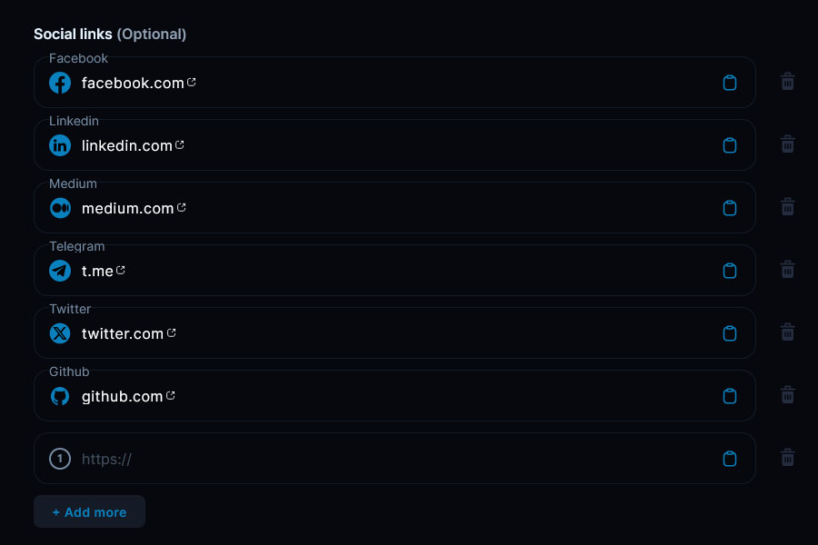
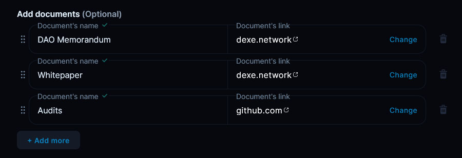

# 1. Create DAO. Basic DAO Settings

After clicking "Create a DAO", you will first specify some basic parameters that will be displayed in your DAO's profile. Here, you can customize the appearance and provide important information, documents, and links for your members.

On this main page, you'll describe your DAO for participants, giving them key details that will always be at their fingertips. You can change all of these details later on except for the DAO name and governance token.

### Step 1: Set Up Your DAO's Profile 

<figure><figcaption></figcaption></figure>

First, upload a profile image to represent your DAO visually.

Next, choose a name for your DAO.&#x20;

Then provide a description of your DAO's mission, values, and goals to introduce it to potential members.


You can always change all details except the DAO name in the future. This will be done through proposals and voting.


### Step 2: Add Direct Contacts 

<figure><figcaption></figcaption></figure>

Optionally, you can create a database of direct contacts for your DAO by linking official brand representative profiles from various platforms like Discord, Facebook, Telegram, and others. This is essential to ensure the authenticity of the created DAO for your users. Don't forget to leave a link to the created DAO in these profiles to further strengthen trust from the community.

### Step 3: Upload Important Documents 

<figure><figcaption></figcaption></figure>

Here, you can publish legal and regulatory documents associated with your DAO. For example:

* Security policies
* Codes of conduct
* Memorandums
* Whitepapers
* Community guidelines


Only upload publicly accessible information. Documents with confidential data like personal details should not be shared here unless explicit consent has been obtained.


That covers the basic settings - your DAO's profile is now ready! Next, we'll dive into configuring detailed governance rules and options.
