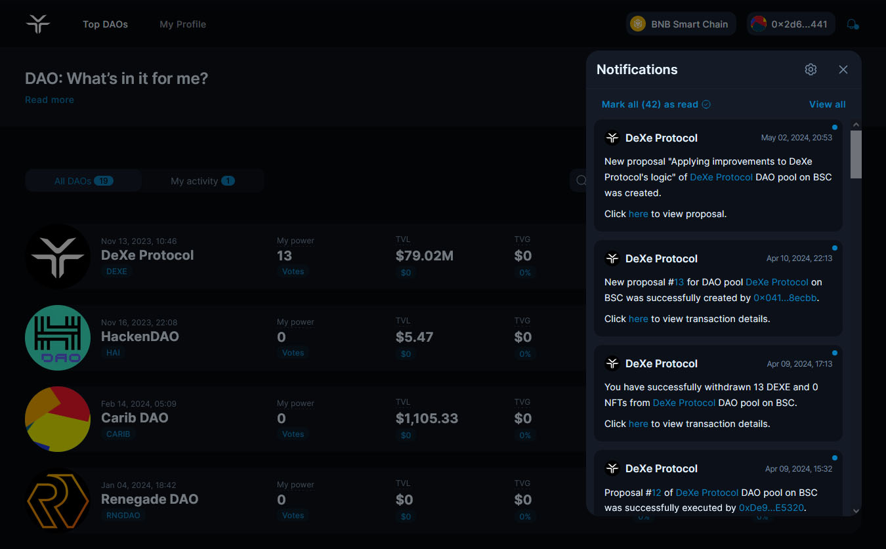
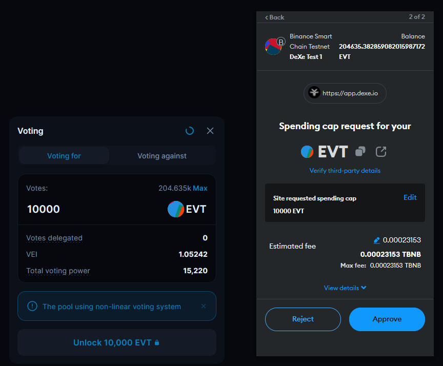
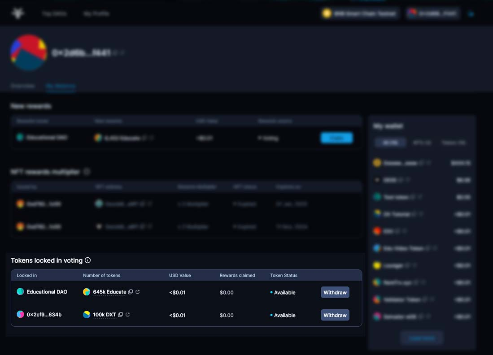

# 📨 How to vote in DeXe DAO Studio

Watch the short video guide for a quick video tutorial on **voting, claiming rewards, and withdrawing tokens back to your wallet**.



## How to find the proposal 

First of all, find the proposal you want to vote for. This can be done in several ways:

### Notifications

<figure><figcaption></figcaption></figure> <figure><figcaption></figcaption></figure>

If you have subscribed to notifications within your DAO, you can stay informed about any new proposals that may arise through messengers or web push.

### DAO profile page

<figure><figcaption></figcaption></figure>

Open the [DeXe DAO Studio app](https://app.dexe.io/), find your DAO and click on it to access the profile page.

<figure><figcaption></figcaption></figure>

You can find the latest proposals directly on the DAO profile page.click on "View All Proposals" to see all the proposals: active, accepted,

<figure><figcaption></figcaption></figure>

If you haven't found the proposal you're looking for, click on "All Proposals" to see all the proposals: active, accepted and rejected.

<figure><figcaption></figcaption></figure>

To see the proposals available for voting now, click on the "Active" tab. Watch the video for more information on navigating the DAO profile page:



## Off-chain Member’s voting 

### What is off-chain voting used for 

Off-chain proposals facilitate ideation, discussion, and consensus-building without immediately executing on-chain actions. It allows for validating concepts and gauging community sentiment before advancing to binding on-chain proposals.

Off-chain proposals offer a risk-free environment to explore ideas, refine proposals, and gather feedback from DAO members before incurring gas costs or executing smart contracts. Three flexible voting options are available: **Yes/No**, **Multiple Choice**, and **Ranking Votes**.

Once consensus is achieved, off-chain proposals aligned with on-chain proposal types can seamlessly transition to that stage, enabling the execution of validated concepts on the blockchain based on community approval.

### How off-chain voting works 

Voting on offline proposals works as follows: when a proposal is created, a snapshot of all token holders' balances is automatically taken, and their voting power is calculated based on these balances at that moment. If you top up your governance tokens balance after the start of the voting, you will not be able to vote on that proposal from that wallet. This is done to prevent multiple voting from different wallets using the same tokens.


Offline voting does not incur gas fees, but [rewards ](rewards-system.md#voting-rewards)are also not distributed. Since offline voting is gas-free, participation does not earn rewards and does not require on-chain execution.


### How to vote off-chain 

<figure><figcaption></figcaption></figure>

Enter the selected active proposal. Familiarize yourself with the proposal and comments. If you have any further questions, participate in the discussion. Once you have made your decision, select the suitable option and click "Vote for proposal".

<figure><figcaption></figcaption></figure>

After clicking on Vote, you will see your voting power calculated based on the snapshot taken when the voting was created. If it is sufficient to participate in the voting, confirm your decision.

<figure><figcaption></figcaption></figure>

Congratulations on voting and contributing to the community's decision-making process. Following the acceptance of decisions that require subsequent implementation in the protocol, an on-chain proposal is usually created.

### How to revoke my vote

You can modify your decision during the off-chain voting process by voting for a different option or withdrawing your vote entirely.

<figure><figcaption></figcaption></figure>

Click on "Cancel vote" to revoke your vote if you have changed your decision.

<figure><figcaption></figcaption></figure> <figure><figcaption></figcaption></figure>

Now you can vote again or abstain from voting.

## On-chain Member’s voting 

### What is on-chain voting used for 

On-chain voting is a governance mechanism that records results on the blockchain and triggers the execution of a transaction that performs the function specified by the proposal type. This can involve various actions, such as assigning user roles within the DAO, transferring funds from the treasury, executing custom contracts, and more. On-chain voting guarantees transparent and secure execution of decisions made through the DAO's predetermined rules and reflects the community's will.


On-chain voting implies gas fees for proposal creation, voting, and execution. However, DeXe DAO Studio has a reward mechanism that compensates DAO members for these costs and encourages participation in governance. You can check if any rewards are activated in the DAO on the DAO voting rules page.


### How on-chain voting works 

Let's break down how on-chain voting works. First, DAO members are presented with a proposal. They then have the option to vote either '**For**' or '**Against**' the proposal. This vote is recorded on the blockchain, ensuring transparency and security.&#x20;

#### Quorum

One key concept in on-chain voting is the quorum. This is the total number of '**For**' or '**Against**' votes needed to approve or reject a proposal. It acts as a threshold, ensuring that a defined part of the community has expressed their opinion before making a decision.&#x20;

In the DeXe DAO Studio, different quorums can be set based on the proposal's nature and impact. For instance, fundamental changes to the DAO rules can require a higher quorum than regular proposals.

#### Voting minimum

Each DAO created with DeXe DAO Studio has a Voting Minimum. This specifies the minimum number of votes required to actually cast a vote on proposals. The Voting Minimum helps prevent bots/spam votes while still allowing broad participation. If you see a message that your balance is insufficient to vote, check your governance token balance and the necessary minimums on the DAO Voting Rules page.

#### Voting duration

You can see how much time is left until the end of voting on the active proposal. The total duration of voting for various proposals is specified in DAO voting settings. Still, the DAO can change it by proposal and voting at any time.


You can view voting durations for different types of proposals on the DAO voting rules page.


Some proposals may have parameters that allow **early vote completion**, which means the voting will end immediately when the minimum quorum, either "for" or "against, is reached without waiting for the entire voting duration.

#### Voting Rewards 

This reward is given to those who vote for proposals the DAO has accepted. In this case, members who vote "For" will receive rewards proportionate to their voting power. The distribution of voting rewards is based on the percentage of tokens involved in voting and is allocated to members according to their voting power.


To learn more about rewards go to the [rewards system ](rewards-system.md#voting-rewards)page.


#### Discussions 

In DeXe DAO Studio, discussion on proposals can be conducted directly within the active proposal. In the DAO settings, the minimum required amount of governance tokens can be set to view, comment, and participate in discussions. This helps to combat spam and promotes productive discussions and better engagement of DAO members in the process. Participate in discussions, ask your questions to the proposal author, and enhance the quality of governance.

### How to vote on-chain

<figure><figcaption></figcaption></figure>

Carefully review the proposal and comments. Then, click on "Vote now."

<figure><figcaption></figcaption></figure> <figure><figcaption></figcaption></figure>

Choose whether you are voting for or against the proposal.

<figure><figcaption></figcaption></figure>

Enter the number of tokens, and click "Unlock". If you are voting for the first time, you will need to perform several transactions.


During on-chain voting, tokens are temporarily locked in the smart contract for the voting period. You can withdraw them back to your wallet at any time, but if you do so before the end of the voting period, your vote will not be counted.


<figure><figcaption></figcaption></figure> <figure><figcaption></figcaption></figure>

<figure><figcaption></figcaption></figure>

Confirm the unlocking of tokens on your wallet and click "Confirm voting".

<figure><figcaption></figcaption></figure>

Confirm your vote in your wallet by clicking "Confirm". You can see the estimated gas fee for the transaction.

<figure><figcaption></figcaption></figure>

Congratulations, you have voted! Until the end of the voting period, you can vote additionally if you have not used your entire balance for voting, and you can also [cancel your vote](how-to-vote-in-dexe-dao-studio.md#docs-internal-guid-b9784611-7fff-fa52-914f-d120dab9dfc9).

If the members voting reach a quorum and approve the proposal, the next step is either the [Validators voting](how-to-vote-in-dexe-dao-studio.md#docs-internal-guid-5983acba-7fff-3c29-9aee-ddb70c2a5c41) or [executing the proposal](how-to-vote-in-dexe-dao-studio.md#docs-internal-guid-2360a755-7fff-5a96-694a-f3bb52a2099f), depending on the DAO's settings.

### How to revoke my vote 

You have the flexibility to change your decision during the on-chain voting process by either voting for the opposing option or retracting your vote entirely.

<figure><figcaption></figcaption></figure>

Press "Revoke my vote" to cancel your vote if you have changed your decision.

<figure><figcaption></figcaption></figure> <figure><figcaption></figcaption></figure>

Sign the transaction and wait for the confirmation of success. You can now choose to cast your vote again or refrain from voting.

### Validators voting 

Validators are trusted members who vote on proposals after the main community vote. Validators add an extra layer of security and oversight to your DAO's governance through a secondary vote.

Voting of validators begins after the end of members voting if the DAO has accepted the proposal. Their approval is required for proposals to be further executed. Validator votes use a separate validator token.

<figure><figcaption></figcaption></figure> <figure><figcaption></figcaption></figure>

Any member can initiate the validator voting process by clicking on the button and signing the transaction. A gas fee is charged for this action.

<figure><figcaption></figcaption></figure>

Once the validator voting starts, validators can proceed to vote. To verify your validator status, you can check the DAO profile page.

<figure><figcaption></figcaption></figure> <figure><figcaption></figcaption></figure>

Select the number of tokens and click "Confirm vote" and sign the transaction.

<figure><figcaption></figcaption></figure>

Congratulations on casting your vote. Now, it's time to proceed with the execution.

### Proposal Execution 

Once an on-chain proposal achieves the necessary number of votes, it advances to the execution phase where the suggested changes are implemented within the on-chain protocol.

To proceed with the execution, identify the proposal that has been successfully voted on and is currently labelled as "Ready to execute."

<figure><figcaption></figcaption></figure> <figure><figcaption></figcaption></figure>

Press the "Execute Proposal" button to proceed. You will also be able to view the transaction fee for the transaction in your wallet.

<figure><figcaption></figcaption></figure>

Congratulations, you have successfully executed the proposal. Further actions required for on-chain implementation will occur automatically.


Transaction Execution Rewards may be provided for proposal execution in the DAO, similar to rewards for voting. You can check if they are enabled on the DAO Voting Rules page. These rewards help cover the expenses for executing transactions post-proposal acceptance. Learn more about rewards [here](rewards-system.md#reward-types).


### Rewards claiming and Token withdraw 

<figure><figcaption></figcaption></figure>

To claim your rewards, visit your profile page. Choose a DAO where you have voted, find your new rewards, and then press “Claim.”

<figure><figcaption></figcaption></figure>

You can also withdraw your tokens back to your wallet after voting by clicking “Withdraw”.

<figure><figcaption></figcaption></figure> <figure><figcaption></figcaption></figure>

Choose the number of tokens you want to withdraw back to your wallet, click "Confirm withdraw", then sign the transaction.

<figure><figcaption></figcaption></figure>

Congratulations, you have successfully withdrawn your tokens back to your wallet. Check the balance on your wallet. For the next voting, you will need to deposit tokens into the Protocol again, as described in the section ["How to vote on-chain".](how-to-vote-in-dexe-dao-studio.md#how-to-vote-on-chain)

All rewards are distributed from the DAO treasury. Any token in the DAO Treasury can be assigned as a reward token. To view the token assigned for reward distribution and other reward settings, check the DAO Voting Rules page.

Rewards will be credited even if the reward token in the treasury has an insufficient balance or is unavailable. In such cases, you can claim your rewards later once the treasury has adequate balance for the reward token.

\
Vote, earn rewards, and contribute to better governance!
