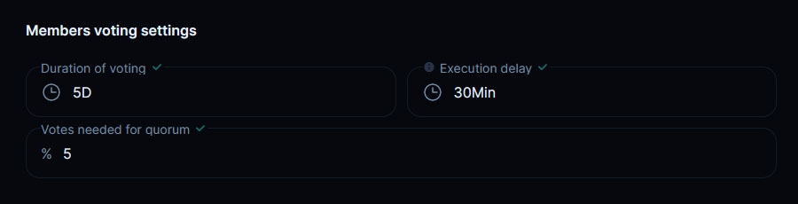

# 2. Change Voting Settings

## How to change Voting Settings: Duration, Quorum, Minimums and Other Parameters 

<figure><figcaption></figcaption></figure>

This template allows you to propose modifying the parameters around different voting types in your DAO. Conveniently update settings like voting duration, quorum minimums, token requirements and more across multiple voting types simultaneously.

Changing voting settings through a single proposal saves time and gas fees compared to making these changes separately. Simply select which voting types you want to update parameters for.

To use the template:

<figure><figcaption></figcaption></figure>

On the proposal creation page, tick the checkboxes next to the voting types you want to modify. For example, you may select "**General Voting**" and "**Token Distribution**". Then click "Next".

## 1. General Voting Setting 

#### Vote Delegation 

<figure><figcaption></figcaption></figure>

Next, decide if members can[ delegate their votes ](../delegated-governance.md)to others.

Enabling delegation allows members to assign their voting power to trusted experts or advisors in the community, facilitating better decision-making by leveraging their expertise. This also saves time and gas fees, while members retain the ability to withdraw delegated votes anytime.

We recommend enabling delegation for more decentralized and efficient governance.

#### Member's Voting Rules 

<figure><figcaption></figcaption></figure>

This section allows you to define key parameters of your DAO's voting process:

* **Quorum** – The quorum is the minimum percentage of voting power needed to accept or reject a proposal. For example, setting a 50% quorum means at least 50% of voting power must participate for the vote to count. Aim for a quorum that's high enough to represent the community, but not so high it's difficult to achieve. Between 30-50% is a good starting point for most DAOs. You can adjust the quorum later through governance if needed. Higher quorums enhance decentralization but may stall proposals.
* **Duration** – The duration sets how long the voting period will last for regular proposals. Choose a duration that gives members reasonable time to review proposals, discuss, and vote. Common ranges are 3-7 days. Shorter durations accelerate decision-making, while longer ones allow more discussion. Consider your community's needs. Like quorum, you can modify the duration through governance after launch.
* **Execution Delay** – The execution delay sets a buffer between the end of voting and proposal execution. For example, a 1-day delay means the proposal can't be executed until 1 day after voting concludes. The delay provides a grace period for members to exit the DAO if they disagree with the outcome.

Set this just long enough for members to react but not so long it stalls execution.

Secure enough votes for a quorum in your DAO to enable customization and governance. Start with smaller values and increase gradually over time.

#### Activate/deactivate validator's voting stage for General Voting 

<figure><figcaption></figcaption></figure>

Validators add an extra layer of security and oversight to your DAO's governance through a secondary vote.

Validators are trusted members who vote on proposals after the main community vote. They act like a board of directors, providing an additional safeguard against malicious proposals. Their approval is required for proposals to be executed.

Validator votes use a separate validator token, created in the next steps. This token cannot be transferred, keeping the validators fixed.

Validators also have special powers like proposing urgent changes without a full vote when needed to maintain the DAO.

#### Validator Voting settings 

<figure><figcaption></figcaption></figure>

Here, set the quorum, duration, and execution delay for the validation vote stage. Validator voting takes effect after the main voting phase.

#### Early Vote Completion 

<figure><figcaption></figcaption></figure>

You have the option to enable early completion of votes once quorum is reached.

If enabled, voting will end immediately when the minimum quorum threshold is hit, without waiting for the full duration.

For example, if your quorum is 50% and duration is 7 days:

* Without early completion: Voting continues for the full 7 days even if quorum is reached on day 2.
* With early completion: Voting ends as soon as ≥50% participate, like on day 3.

Enabling early completion can accelerate decision-making since votes finish faster when quorum is achieved ahead of schedule.

However, there are some tradeoffs:

* Members have less time to change their minds or switch votes.
* Discussions may be cut short before everyone has fully debated.
* When voting rewards are enabled, it will not burn extra tokens.

Ultimately, it depends on your DAO's needs. Faster-moving organizations may benefit from ending votes early when possible. However, other DAOs may prefer giving the full pre-defined duration for decisions.

We recommend enabling early completion for governance optimization.

#### Set Minimums 

<figure><figcaption></figcaption></figure>

This section allows you to define the minimum number of votes members must hold to:

* Create proposals
* Participate in votes

**Proposal Creation Minimum**

This sets how many votes a member needs to be able to create a proposal.

Requiring even just 1 or 2 votes ensures members have skin in the game before proposing changes.

You want active participation, but avoid setting this so high it limits community voices.

**Voting Minimum**

This defines the minimum votes required to actually cast a vote on proposals.

Again, even a 1 vote minimum helps prevent bots/spam votes while still allowing broad participation.

Balance keeping voting accessible with making sure voters are real stakeholders.

#### Community Rewards for General Voting 

<figure><figcaption></figcaption></figure>

Enabling community rewards allows your DAO to incentivize participation through token distributions. You can establish rewards for:

* **Voting Rewards** – These incentives are awarded to members who vote on accepted proposals. The reward amount is proportional to the member's voting power used. Voting rewards encourage turnout for important decisions.
* **Proposal Creation Rewards** – These rewards compensate members who author proposals that get accepted. They incentivize members to contribute ideas and take initiative. You set a fixed token amount per accepted proposal.
* **Transaction Execution Rewards** – These offsets the gas costs of executing transactions related to accepted proposals. They ensure active members aren't losing money governing your DAO. You again set a fixed token reward amount per transaction.

Consider enabling all three types to engage your community. However, be thoughtful - excessive rewards could incentivize low-value proposals and votes, depleting your DAO's treasury.

Balance the reward amounts to achieve your goals and leave room for adjustment through governance later.

Enabling community rewards is powerful, but requires diligence to maximize community benefit sustainably.


Learn more about the Rewards system at the [link.](../rewards-system.md)


<figure><figcaption></figcaption></figure>

Check your desired changes to those voting parameters and click "Next."

## 2. Token Distribution Settings 

<figure><figcaption></figcaption></figure>

Now modify the "Token Distribution" voting settings as needed and click "Next".

## 3. Select the proposal creation method 

<figure><figcaption></figcaption></figure>

Select if you'll create this proposal directly with your tokens, or use metagovernance delegation.

## 4. Basic proposal info 

<figure><figcaption></figcaption></figure>

Provide a clear title and comprehensive description so members understand what's being proposed. Review and click "Vote & Create Proposal" to launch the proposal and self-vote.

## 5. Create a proposal 

<figure><figcaption></figcaption></figure>

Specify the number of tokens you want to use and confirm the transactions.

<figure><figcaption></figcaption></figure>

Click "Create" to launch the proposal, sign the transaction in your wallet and self-vote.

<figure><figcaption></figcaption></figure>

Once live, participate in discussions around your voting changes proposal. If the quorum is reached, the new parameters will go into effect after execution.

Use this template any time you want to tweak and optimize your DAO's voting rules and processes.
