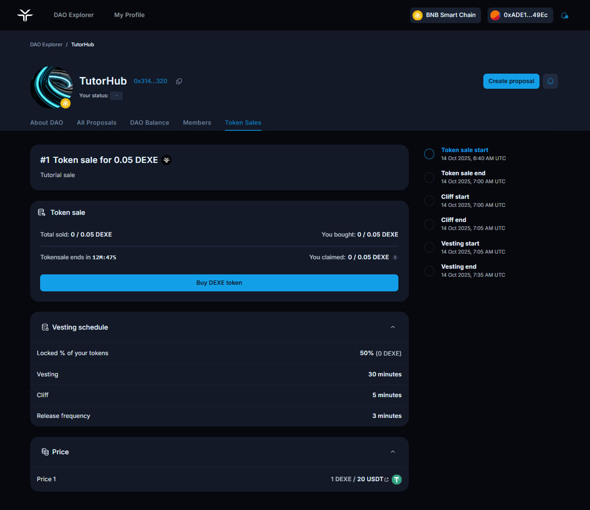
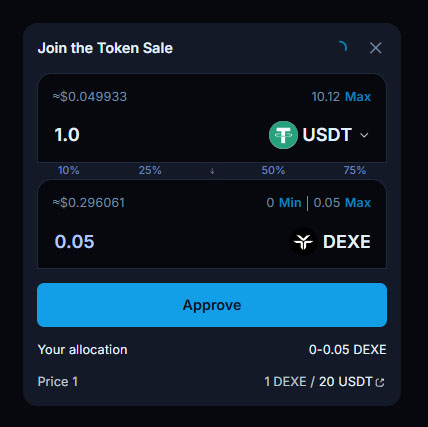
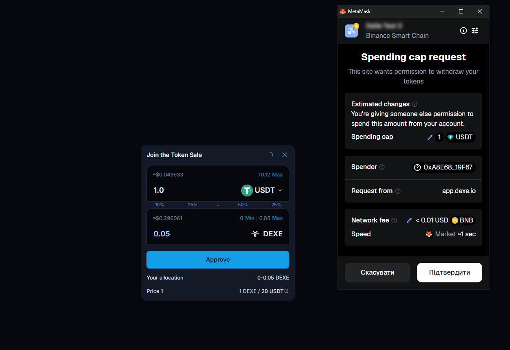
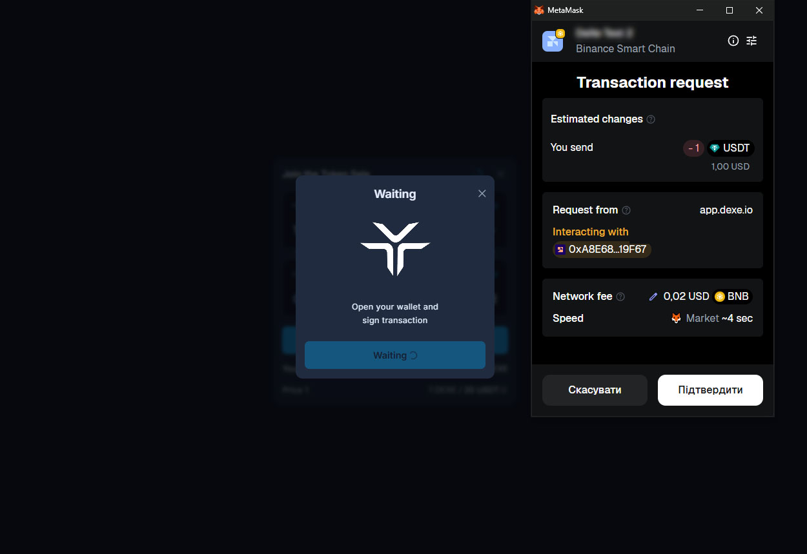
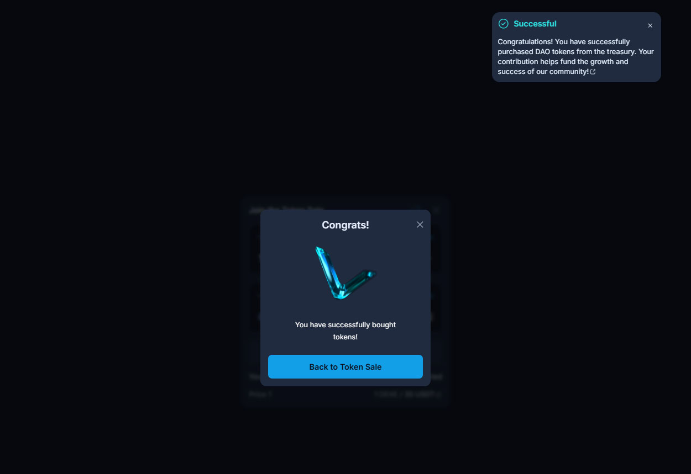
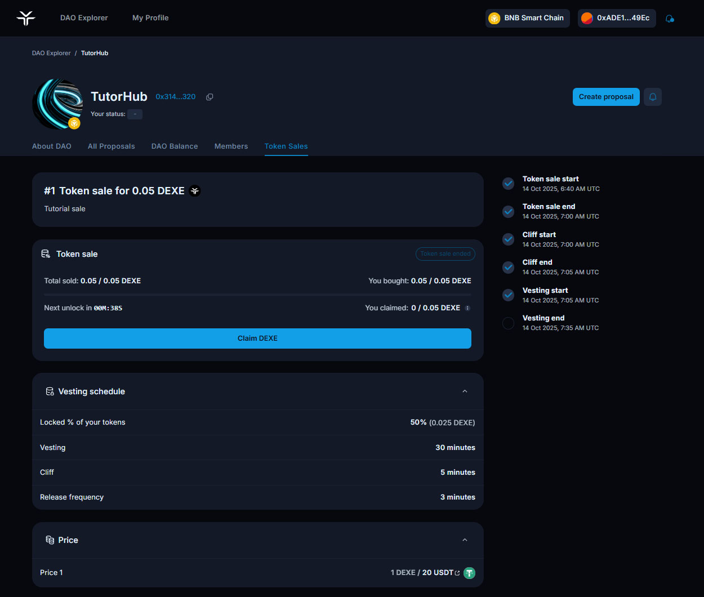
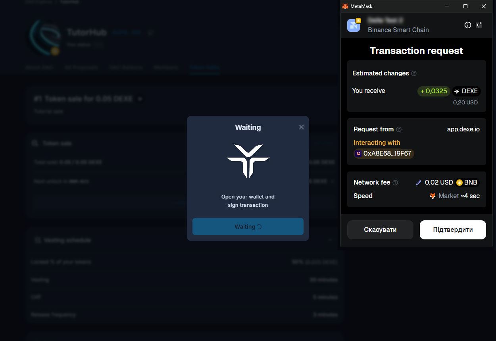

# Participating in the Token Sale

This guide explains how to participate in a token sale on [DeXe dApp](https://app.dexe.io/) and claim tokens according to the vesting schedule.


### Prerequisites

A Web3 wallet with a sufficient balance of the accepted payment asset (e.g., USDT) and enough native tokens for network fees (BNB Chain or Ethereum). If you are participating in a private token sale, ensure that your wallet address is included in the whitelist; otherwise, you won’t be able to join the sale.


### 1. Navigate to the Token Sale

Open the DeXe App, locate the DAO running the Token Sale, click on it to access the profile page, or follow the provided direct link.

<figure><figcaption></figcaption></figure>

In the DAO Profile, select the Token Sales tab, and choose a sale you want to participate in.

<figure><figcaption></figcaption></figure>

### 2. Participating in Token Sale

Click on a sale card to open full details. Here you can review all the key information about the token sale: which token is being sold, its price, available pairs, participation limits, and current sale progress.

If the sale includes **vesting**, part or all of your purchased tokens may be locked for a specific period. You can view the **cliff** and **vesting schedule** directly on the sale page, and for convenience, the exact start and end times of each period are also displayed on the right panel.


**Cliff**: A no‑release period at the start of vesting. Once it ends, an initial chunk becomes available, and subsequent releases follow the schedule.

**Vesting**: A schedule that gradually makes purchased tokens available over a defined period, aligning the community with long‑term success.

**Release frequency**: The interval between token unlocks once vesting has started (e.g., monthly, weekly, etc.).


<figure><figcaption></figcaption></figure>

### 3. Buying a token

After you’ve reviewed all the sale details and confirmed that everything looks good, click **Buy Token**.\
Choose how many tokens you want to purchase the system will automatically show the price and your allocation.

When you’re ready, click **Approve**.

<figure><figcaption></figcaption></figure>

Next, you’ll need to **sign two transactions**:

1. **Approve** — allows the smart contract to use your payment asset.
2. **Purchase** — executes your token buy on-chain.

<figure><figcaption></figcaption></figure> <figure><figcaption></figcaption></figure> <figure><figcaption></figcaption></figure>

### 4. Claiming Tokens (Sales with Cliff & Vesting)

If the sale has a cliff and vesting, you claim tokens as they unlock.


If a **cliff** is active, no tokens can be claimed until the cliff ends.

The **Next unlock** timer shows when the next portion becomes claimable.


**To claim:**

1. Return to the DAO’s **Token Sales** tab and open the same sale.
2. When a portion of the tokens is unlocked, click the Claim button.
3. Confirm the claim transaction in your wallet.

<figure><figcaption></figcaption></figure> <figure><figcaption></figcaption></figure>

Congrats, tokens are sent to your wallet. Repeat the claim process each time a new portion unlocks until the **Vesting end**.
