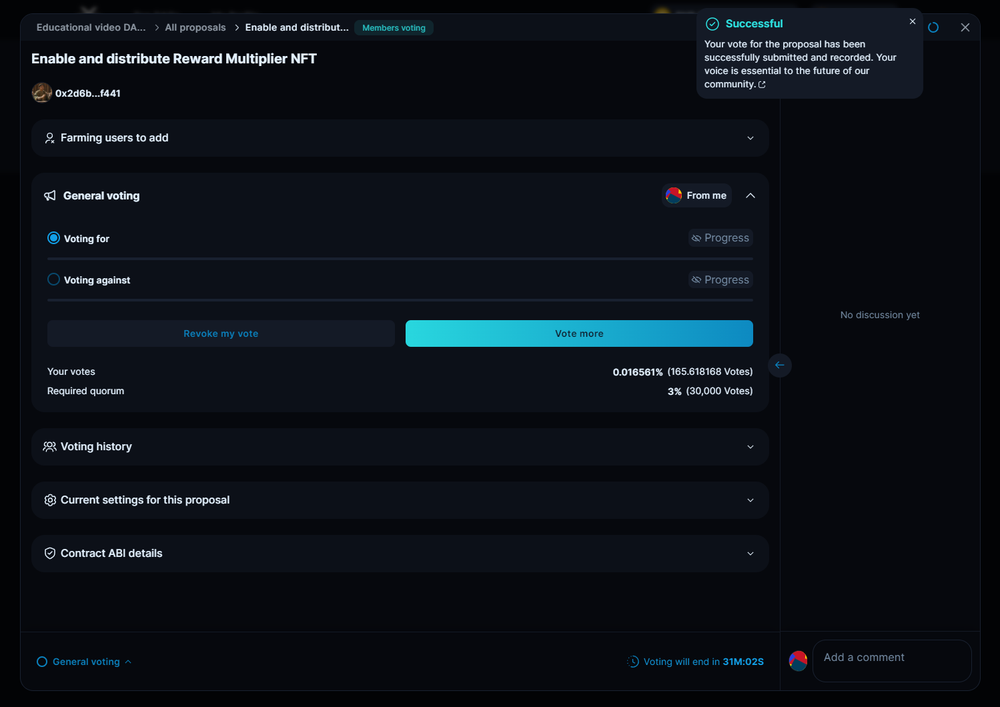

# 9. Reward multiplier NFT

## How to set Reward Multiplier NFT

The Reward Multiplier NFT in the DeXe DAO ecosystem incentivizes active token holder participation by applying a multiplier [to base rewards for voting and proposal creation](../rewards-system.md). The multiplier varies depending on the specific NFT held, obtainable through various DAO activities or secondary market trading. This feature encourages engagement and ensures the DAO is guided by invested members.

### 1. Reward Multiplier NFT setup 

<figure><figcaption></figcaption></figure>

You may activate the Reward Multiplier NFT feature. Conversely, you can deactivate it if you wish to disassociate it from your DAO.

<figure><figcaption></figcaption></figure>

Kindly input the address of your pre-existing NFT collection, or leave it blank to generate a collection within DeXe Studio. Additionally, you have the option to efficiently upload a .csv file containing the list of recipients for a streamlined process.

<figure><figcaption></figcaption></figure>

To set up the Reward Multiplier NFT feature for your DAO, follow these steps:

1. **Upload Avatar** – Choose an image file that will represent the NFT collection visually. This will be the avatar or image that NFT holders will see.
2. **Provide Recipient Addresses** – Enter the wallet addresses of DAO members who should receive the Reward Multiplier NFTs. You can add as many addresses as needed by separating them with commas or spaces. Alternatively, you can upload a .csv file containing the list of recipient addresses for easier bulk addition.
3. **Set Expiration Date** – Specify the date when the reward multiplier benefits tied to these NFTs will expire. After this date, NFT holders will no longer receive increased rewards.
4. **Configure Reward Multiplier** – Set the reward multiplier value that will apply to base rewards for voting and submitting proposals. For example, if the multiplier is set to 2x, NFT holders will earn double the usual rewards compared to non-NFT holders.

Once you have configured the avatar, recipient addresses, expiration date, and reward multiplier value, click the "Next" button.

### 2. Select the proposal creation method 

<figure><figcaption></figcaption></figure>

Select if you'll create this proposal directly with your tokens, or use[ metagovernance ](../meta-governance.md)delegation.

### 3. Basic proposal info 

<figure><figcaption></figcaption></figure>

Provide a clear title and comprehensive description so members understand what's being proposed. Review and click "Vote & Create Proposal" to launch the proposal and self-vote.

### 4. Create a proposal 

<figure><figcaption></figcaption></figure>

Specify the number of tokens you want to use and confirm the transactions.

<figure><figcaption></figcaption></figure>

Click "Create" to launch the proposal, sign the transaction in your wallet and self-vote.

<figure><figcaption></figcaption></figure>

Once live, participate in discussions around your voting changes proposal.

<figure><figcaption></figcaption></figure>

If the quorum is reached, NFTs will be distributed to the recipient's wallets after proposal execution.

<figure><figcaption></figcaption></figure>

Users need to activate the NFT in their profile to claim rewards with the multiplier. Click "Activate" and sign the transaction.

<figure><figcaption></figcaption></figure>

Once your NFT is activated and locked, you will receive rewards according to the NFT multiplier. Only one NFT with a rewards multiplier can be used by the user simultaneously in DAO.

Use this template whenever you want to manage the Reward multiplier NFTs.
