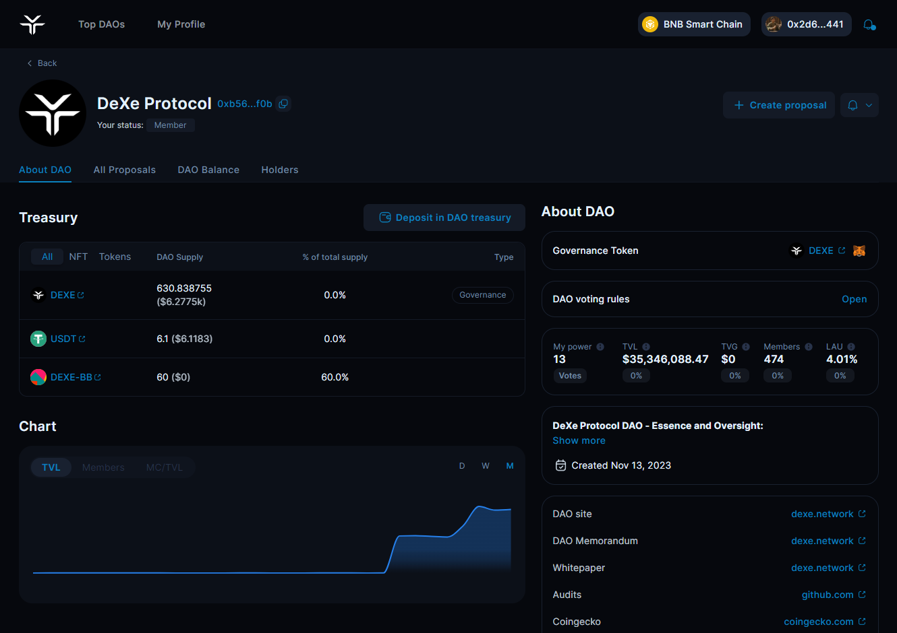

# Proposals Creation

To make proposals in your DAO, you must possess the required amount of governance token(s) or use [meta-governance.](../meta-governance.md) Check the "Voting Rules" section in your DAO profile for the minimum token balance needed to create proposals.

For a quick video tutorial on creating proposals, watch the [3-minute guide](https://youtu.be/-hyXfXbA4PU).



## Create a proposal 

<figure><figcaption></figcaption></figure>

To get started, navigate to your DAO's page and click "Create Proposal." In DeXe DAO Studio, we've grouped all common proposal types that help manage DAOs for your convenience. On the proposal creation page, you'll find templates organized into categories. Choose one of the templates or create your own.

<figure><figcaption></figcaption></figure>

## Proposal Templates 

### [1. Modify DAO Profile](1.-modify-dao-profile.md#docs-internal-guid-107b2ea2-7fff-469c-9421-d700ac2bdb4f) 

### [2. Change Voting Settings](2.-change-voting-settings.md) 

### [3. Change Voting Model](3.-change-voting-model.md) 

### [4. Token Transfer](4.-token-transfer.md) 

### [5. Token Sales](5.-token-sales.md) 

### [6. Manage Validators](6.-manage-validators.md)

### [7. Token Allocation for Validators](7.-token-allocation-for-validators.md)

### [8. Blacklist management](8.-blacklist-management.md)

### [9. Reward multiplier NFT](9.-reward-multiplier-nft.md) 

### [10. Add Local Experts](10.-add-local-experts.md)

### [11. Remove Local Experts](11.-remove-local-experts.md)

### [12. Delegate tokens](12.-delegate-tokens-from-the-treasury.md)

### [13. Revoke tokens](13.-revoke-tokens-to-the-treasury.md)

### [Off-chain proposals](off-chain-proposals.md)

\

\

\
